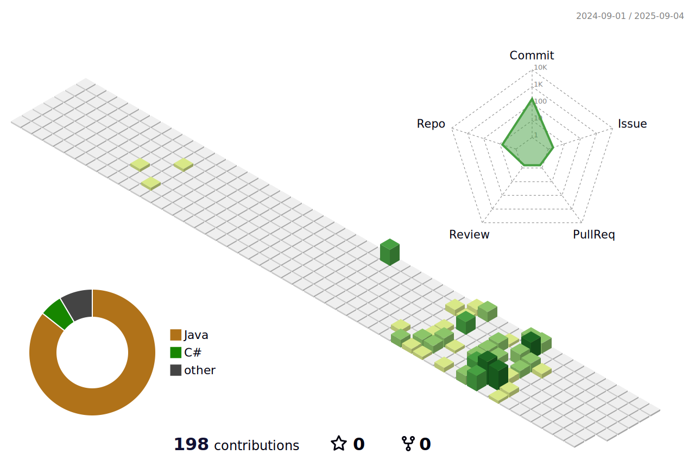

# Hello 👋, I'm Mert Yıldız
### Software Test Engineer

I am an ISTQB Certified Software Engineer with strong QA methodology, tools and automation skills. Experienced in testing with Java and Selenium and doing API testing using Postman and Proxyman. I have knowledge of SQL for data validation.

<h3 align="left">Connect with me:</h3>

<h3 align="left">Languages and Tools:</h3>

&nbsp;
&nbsp;
&nbsp;
&nbsp;
&nbsp;
&nbsp;
&nbsp;
&nbsp;
&nbsp;
&nbsp;
&nbsp;
&nbsp;
&nbsp;
&nbsp;

🔭 I’m currently working on: **Automation testing with Java, Selenium, TestNG, Cucumber, Postman, Rest Assured.**

📫 How to reach me: **1yildizmert@gmail.com**

⚡ Fun fact: **I enjoy solving complex situations.**

