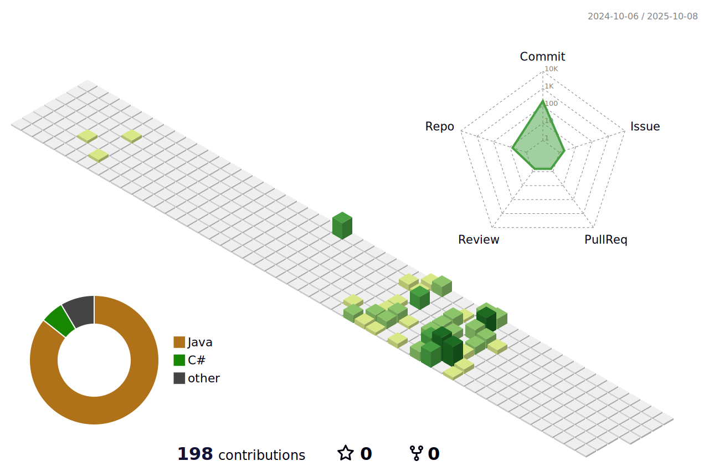

# Hello 👋, I'm Mert Yıldız
🔍 I am an ISTQB-certified QA engineer with a solid foundation in software testing principles, test design techniques, and the QA lifecycle.

💻 I have hands-on experience in creating automated UI tests using Java, Selenium, and various test frameworks.

🌐 I perform API testing using Postman and Rest Assured, with proficiency in request chaining, environment configuration, and response validation.

🗄️ With my knowledge of SQL, I can efficiently perform data verification and backend checks.

⚙️ I have experience in both manual and automated testing. I am committed to continuous learning and focused on delivering high-quality, reliable software.

<h3 align="left">Connect with me:</h3>

<h3 align="left">Languages and Tools:</h3>

&nbsp;
&nbsp;
&nbsp;
&nbsp;
&nbsp;
&nbsp;
&nbsp;
&nbsp;
&nbsp;
&nbsp;
&nbsp;
&nbsp;
&nbsp;
&nbsp;

🔭 Currently focused on automation testing using Java-based tools such as Selenium, TestNG, and Cucumber, as well as API testing and validation using Postman and Rest Assured.

📫 How to reach me: **1yildizmert@gmail.com**

⚡ Fun fact: **I enjoy solving complex situations.**

